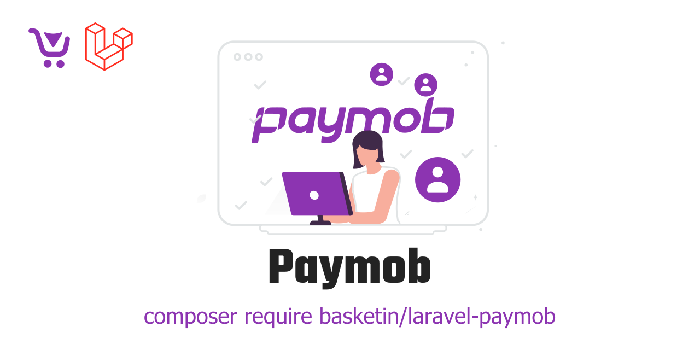

<p align="center"><a href="#" target="_blank"></a></p>

<p align="center">
  <a href="https://packagist.org/packages/basketin/laravel-paymob" target="_blank"></a>
  <a href="https://packagist.org/packages/basketin/laravel-paymob" target="_blank"></a>
</p>

# Basketin Paymob

The customers' module lets you register and manage customers and support Filament.

## Documentation

### Installation

Install via composer.

```bash
composer require basketin/laravel-paymob
```

You need to migrate the package tables.

```bash
php artisan migrate
```

### How to use

#### Create a link for payment

You can create a new link for payment using the following code.

```php
<?php

use Basketin\Paymob\Configs\PaymentMethod;
use Basketin\Paymob\Pay;

$pay = new Pay;
$pay->setMethod(new PaymentMethod('wallet'));
$pay->setAmount(1000);
$pay->setMerchantOrderId(1234567);
return $pay->getLink();
```

#### Configs payments

```bash
php artisan vendor:publish --tag=basketin-paymob-config
```

And you can manage payments

```php
...
'payments' => [
    'wallet' => [
        'api_key' => '<api_key>',
        'integration_id' => 00000,
        'iframe_id' => 00000,
    ],
],
...
```

## Contributing

Thank you for considering contributing to this package! Be one of the Store team.

## License

This package is an open-sourced software licensed under the [MIT license](https://opensource.org/licenses/MIT).
